# MLOps Project: Continuous Integration and Continuous Deployment (CI/CD)

This README provides a structured guide for building an MLOps project using Python, Flask, and AWS Elastic Beanstalk with CI/CD pipelines. The project focuses on deploying a machine learning pipeline for a student performance indicator system.

---

## 1. **Setting up the GitHub Repository**

### a. Create a Virtual Environment
- Use the command: `python -m venv .venv` to create a virtual environment.
- Activate it using `\.venv\Scripts\activate` (Windows).
- Freeze dependencies into `requirements.txt` to manage project-specific libraries.
- Add a `.gitignore` file to exclude unnecessary files (e.g., `.venv`, `artifacts/`).

**Placeholder for Virtual Environment Image**

### b. Create `setup.py`
- `setup.py` allows you to package your project for reuse and deployment.
- To identify the project's packages, structure your code with a `src` folder containing an `__init__.py` file. Example:
  ```
  src/
    __init__.py
  ```
- Use the `find_packages()` function in `setup.py` to locate all `__init__.py` files.
- Link `setup.py` to `requirements.txt` by adding `-e .` in the latter. Install dependencies with:
  ```
  pip install -r requirements.txt
  ```
  
**Placeholder for Setup.py Example Image**

### c. Automate File Creation (Optional)
- Use a `template.py` script to automate boilerplate creation, but manually setting up files is recommended for beginners to understand their roles.

---

## 2. **Logging and Exception Handling**

### a. Create a `component` Folder
- This folder organizes key functionalities:
  - `data_ingestion.py`: Handles data extraction, splitting into train/test.
  - `data_transformation.py`: Manages data preprocessing like encoding and scaling.
  - `model_trainer.py`: Trains models and evaluates performance (e.g., R² score).
  - `model_pusher.py`: Pushes the trained `model.pkl` file to cloud storage.

**Placeholder for Component Folder Image**

### b. Create a `pipeline` Folder
- Defines the overall workflow:
  - `train_pipeline.py`: Integrates data ingestion, transformation, and model training.
  - `prediction_pipeline.py`: Handles inference for new data.

**Placeholder for Pipeline Folder Image**

### c. Add Utility Scripts
- **`exception.py`**: Centralized exception handling.
- **`logger.py`**: Logs errors and runtime information.
- **`utils.py`**: Helper functions for dependencies and reusable code.

---

## 3. **Defining the Problem Statement**

### Student Performance Indicator
- Use Jupyter Notebook for Exploratory Data Analysis (EDA).
- Install `ipykernel` to run Jupyter in your virtual environment.
- Analyze data to uncover insights and prepare observations for implementation.

**Placeholder for EDA Notebook Image**

---

## 4. **Data Ingestion Implementation**

### Goals:
- Extract data from local sources or databases (e.g., MongoDB).
- Split data into training and testing sets.
- Store processed data in an `artifacts/` folder. (Add `artifacts/` to `.gitignore` to avoid pushing it to GitHub.)

**Placeholder for Data Ingestion Image**

---

## 5. **Data Transformation Pipeline**

### Goals:
- Perform feature engineering and data cleaning.
- Use transformers for scaling, encoding, and preprocessing.
- Ensure consistency with the training dataset structure.

**Placeholder for Data Transformation Image**

---

## 6. **Model Training**

### Goals:
- Train a machine learning model.
- Save the trained model as a `model.pkl` file in the `artifacts/` folder.

**Placeholder for Model Training Image**

---

## 7. **Hyperparameter Tuning**
- Implement techniques like Grid Search or Random Search to optimize model performance.
- Use cross-validation for robust evaluation.

**Placeholder for Hyperparameter Tuning Image**

---

## 8. **Prediction Pipeline**

### Goals:
- Develop a Flask-based web application.
- Provide endpoints for:
  - Home: `http://127.0.0.1:5000/`
  - Predictions: `http://127.0.0.1:5000/predictions`
- Interact with the `model.pkl` file for inference.

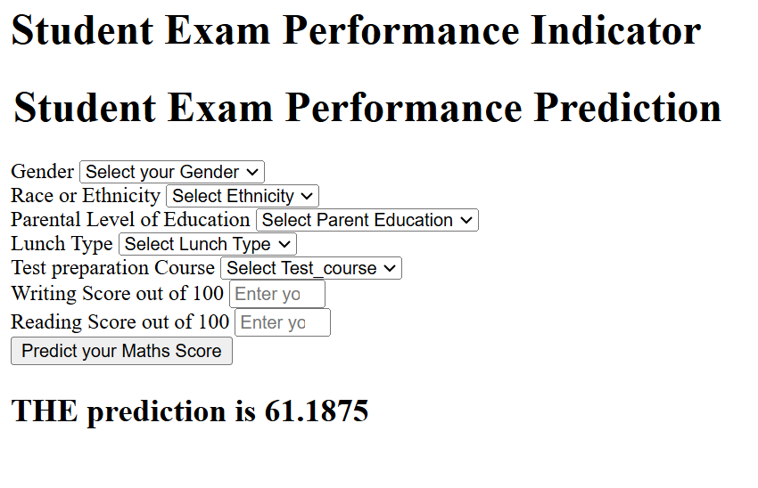

---

## 9. **Project Deployment Using AWS Elastic Beanstalk**

### AWS Elastic Beanstalk Overview
- AWS Elastic Beanstalk orchestrates AWS services (e.g., EC2, S3, SNS, CloudWatch) for easy application deployment.
- Automates server configuration, scaling, and load balancing.
- AWS has a feature called codepipeline which gives a framework for **continous delivery**. Basically, using the python file we have a eb instance and we have our githun repo where all the code is. To connect both these we use this codepipeline provided by AWS.


### Configuration
1. **`.ebextensions` Folder**
   - Create a `python.config` file specifying the application's entry point:
     ```
     WSGIPath: application:application
     ```
   - Ensure the entry point (`application.py`) is correctly defined.

**Placeholder for .ebextensions Folder Image**

2. **AWS Elastic Beanstalk Setup**
   - Create an AWS account (requires a credit card).
   - Navigate to Elastic Beanstalk and create a new application (e.g., "Student Performance") under the Top Features option.
   - Select the Python platform and configure your environment.
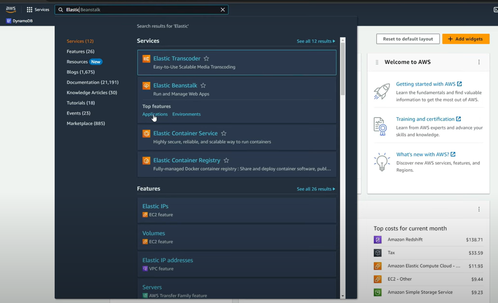
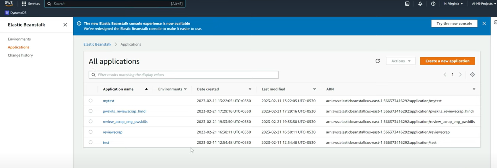
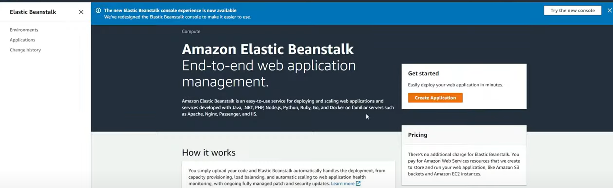
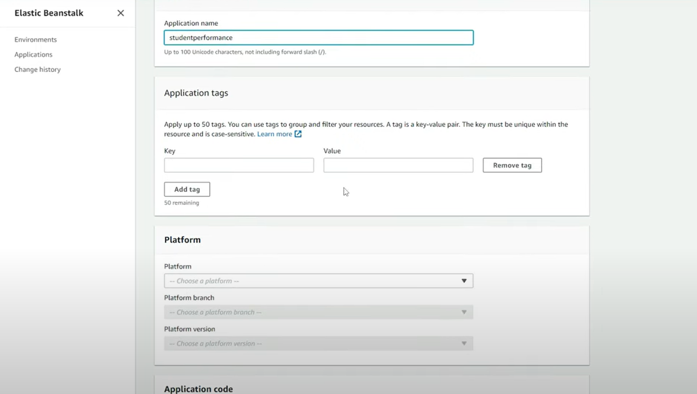
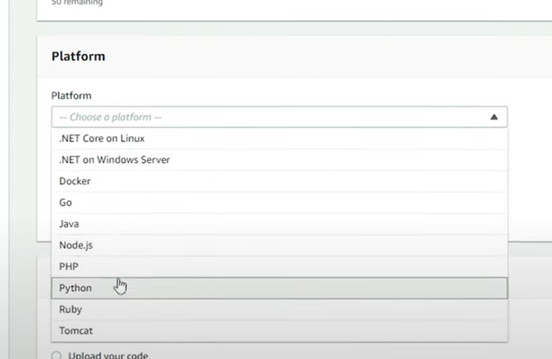

We select python as the environment for the eb instance (we can also have docker).

3. **CI/CD Pipeline with AWS CodePipeline**
   - Use AWS CodePipeline for continuous delivery.
   - Connect the GitHub repository to automate deployment to Elastic Beanstalk.
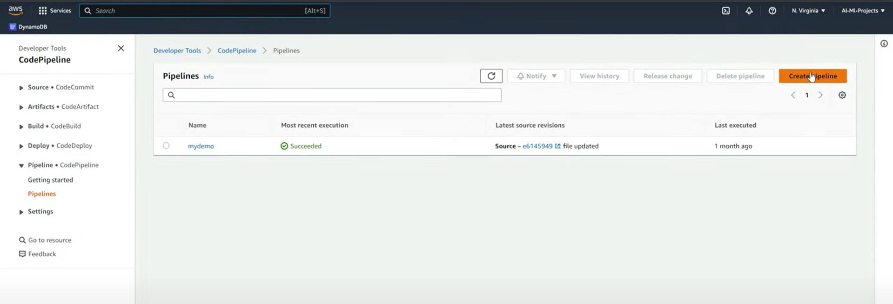
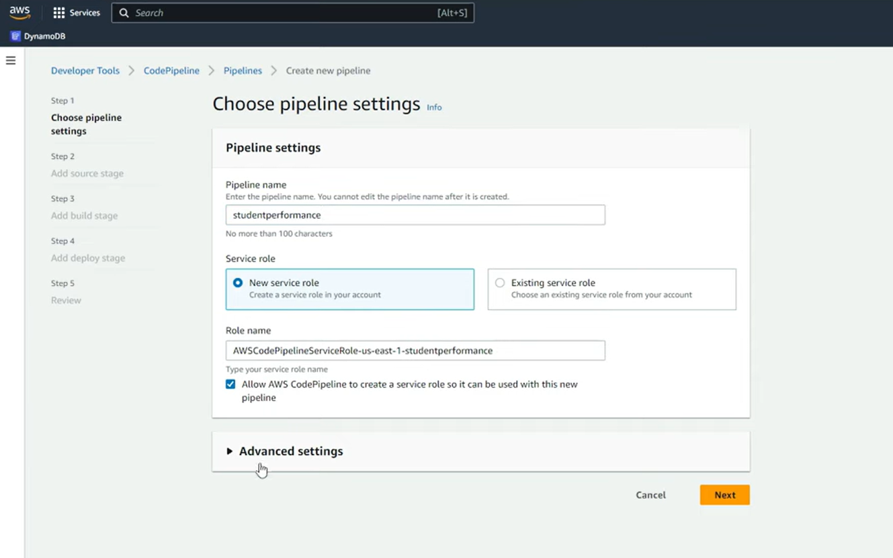
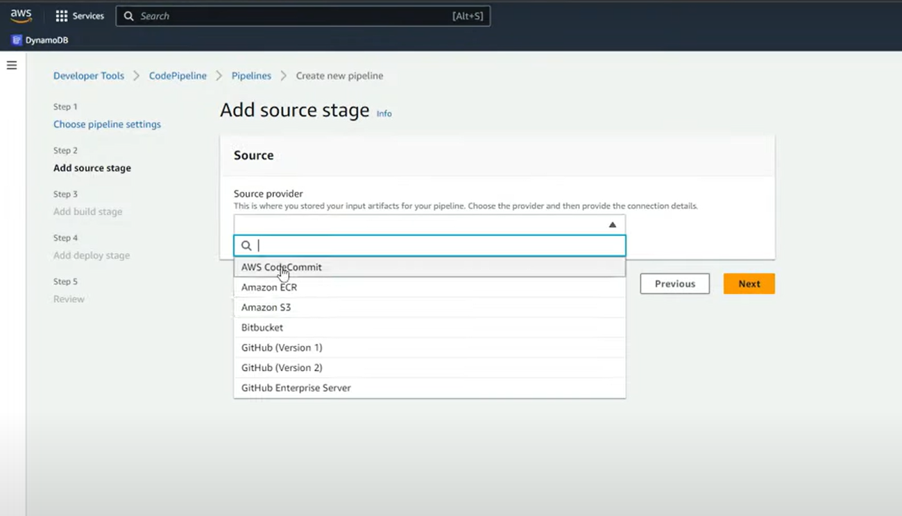
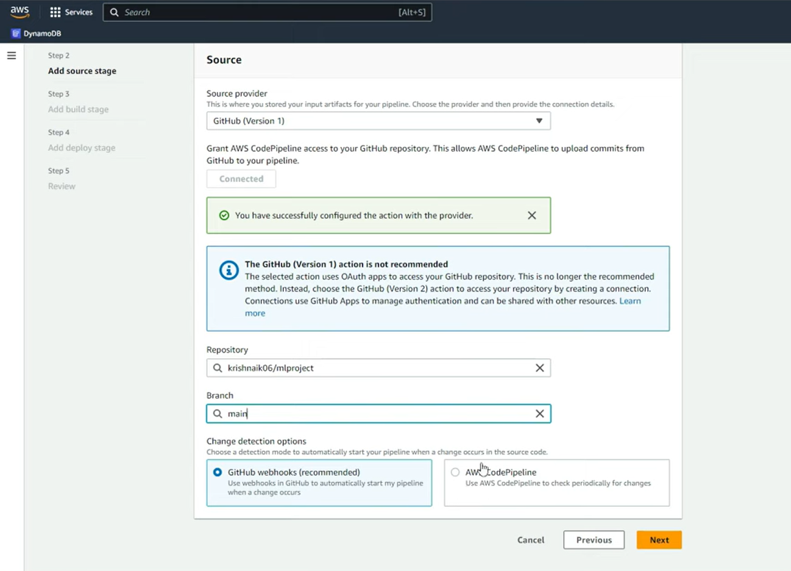
Here we give out github repo path and branch

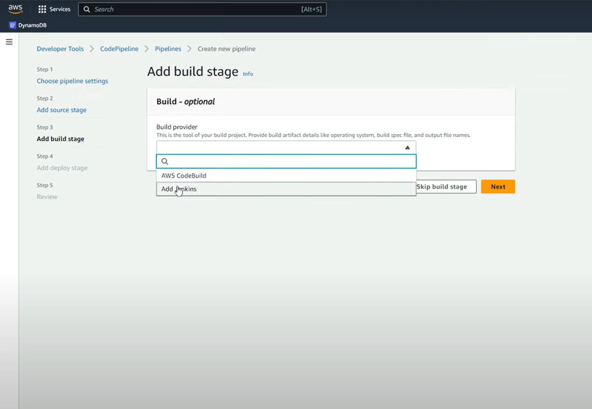
AWS Jenkins can be added for building tests.

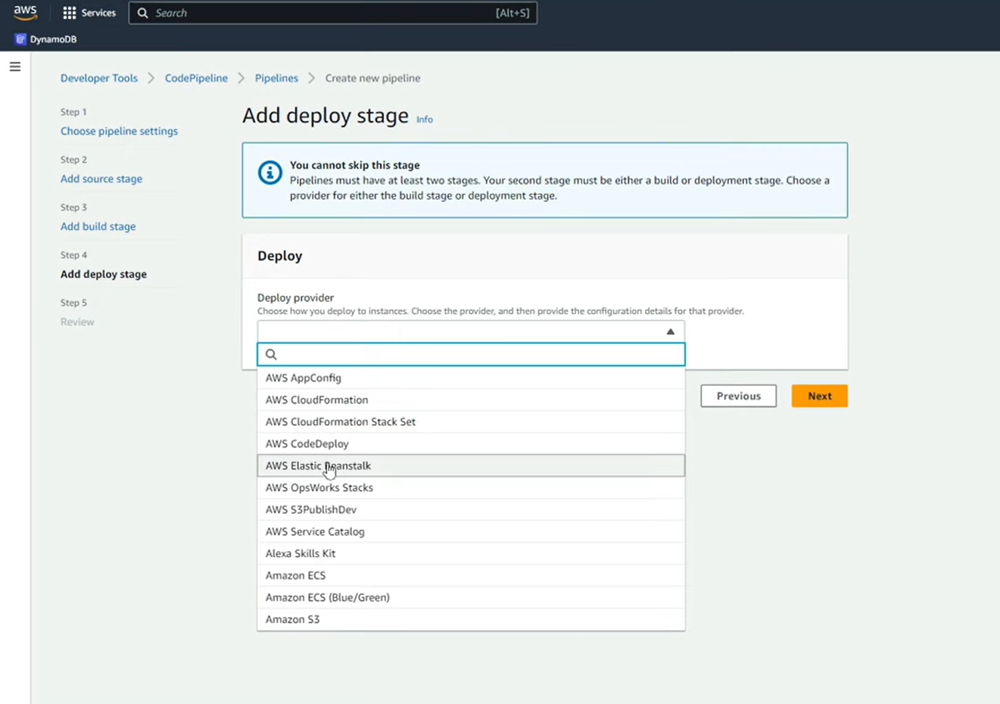
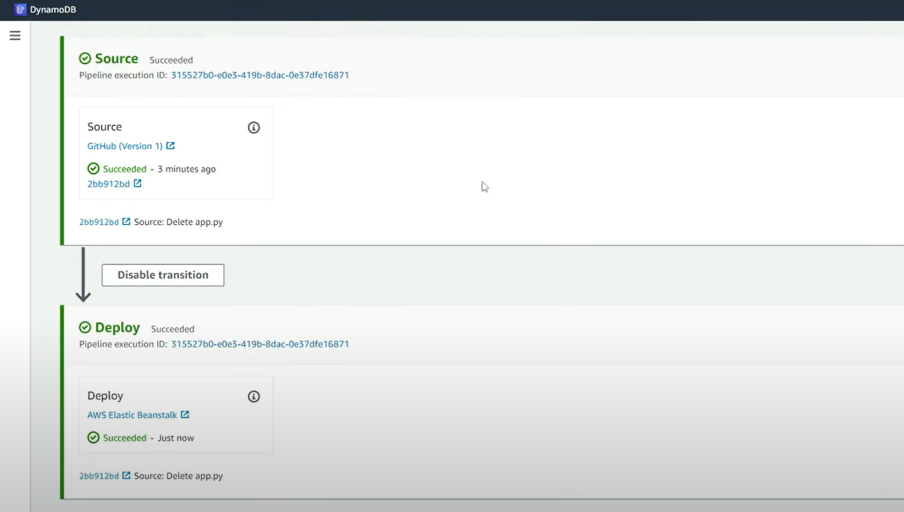
---

## Notes
- **Docker and Python Virtual Environments**: A Docker container also needs Python installed to run a Python application. However, the key difference is that Python in Docker is bundled as part of the container image, independent of the host system. This ensures:
  - **Portability**: The container can run on any system with Docker installed, regardless of the host's Python version.
  - **Reproducibility**: The Python version and dependencies remain consistent across environments (e.g., development, testing, production).
  - **Isolation**: Each container is fully isolated, preventing conflicts with other projects or system-level dependencies. Therefore we don't have conflicts arising due to different OS, machines etc.
- Update this README with screenshots of deployed applications, pipelines, and results.
- Add detailed explanations for each implementation step in future updates.
- Can use python linter to avoid warning and manage test quality.
- Logging and checkpointing system can be used as tests
- **Docker Basics**:
  - **Docker File**: A docker file is basically instructions constaing how the docker container must look. It specifies the type of environement like (python, java etc..), libraries which needs to be installed, command to run it etc..
  - **Dcoker Image**: The Python version and dependencies remain consistent across environments (e.g., development, testing, production).
  - **Dcoker Container**: Each container is fully isolated, preventing conflicts with other projects or system-level dependencies. Therefore we don't have conflicts arising due to different OS, machines etc.

---

## Deployment Using Docker

- Docker File
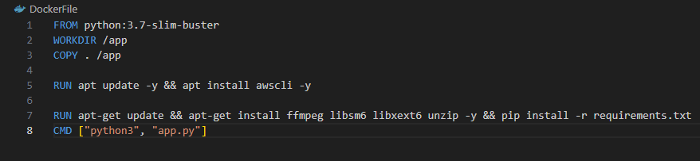

As you can see in the picture we specify how the docker container needs to be configured. We mention the environment from which docker will pull the image. Then we make a directory called /app in this environement and copy our entire project in it.

Subsequent steps in the picture after COPY shows how the run it.

This is run by ` docker build filename ..`

- Docker Image

Taking the instructions from the docker file we can build an image. Say if the python environment is not there in my local repository then docker looks into it's registry in the cloud (or wherever it is) and pulls it.

In hub.docker.com you can find the list of all docker registries. If you have an image which can benefit other then you can push as well.

Once we have this image (like template or blueprint) this can be used to create a container, based on the template which exists in the image.

This run by `docker run ...`

- Docker Container

A docker image can create a single or many conatiners.Each of them can be started or stopped using start/stop commands.

Lightweight comapred to virtual machines

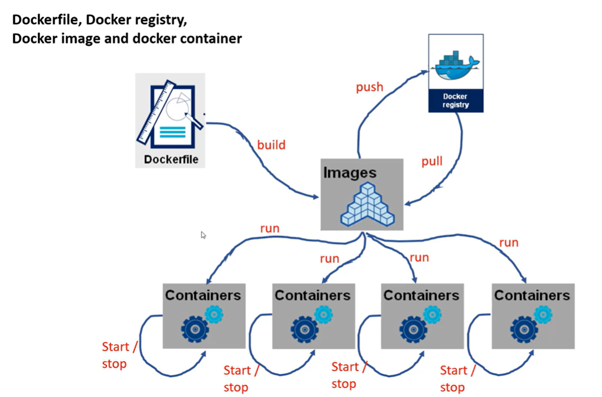
---

## NOTE
Say your making a house (Analogy):

- Material needed (bricks, cement) --> docker file
- Blueprint of house --> docker image
- Final house(s) --> docker container.

---

## Docker Workflow

The workflow integrates CI/CD processes, which can be found in the `.github` folder of the project. The CI/CD pipeline uses a workflow available in the GitHub Actions Marketplace. Below are the key steps involved:

### 1. Integration
You can specify the environment (e.g., machine type) where the workflow runs, execute unit tests, and ensure pre-deployment validation. Examples of unit tests include:
- **Error Handling**: Validating how the system reacts to unexpected inputs.
- **Input/Output Size Check**: Ensuring input and output adhere to the expected dimensions.
- **Performance Testing**: Verifying execution within acceptable time/memory limits.
- **CPU/GPU Compatibility**: Ensuring the application runs on both CPU and GPU setups without issues.

### 2. Building and Pushing to Amazon ECR
AWS Elastic Container Registry (ECR) is used to securely store private Docker images. The pipeline builds the Docker image and pushes it to the ECR repository. From there, deployment is executed on an Amazon EC2 instance. This step involves:
- Setting up AWS CodePipeline for continuous delivery.
- Validating AWS credentials for secure operations.

### 3. Continuous Deployment
The latest Docker image is automatically pulled from Amazon ECR and deployed on an EC2 instance. This ensures the system always runs the most up-to-date version of the application.

---

### Overall Steps in the Workflow:

1. **Docker Build**: Create a containerized application.
2. **GitHub Actions Workflow**: Automate CI/CD steps.
3. **AWS IAM Configuration**: Set up an IAM (Identity and Access Management) user with permissions for ECR and EC2.

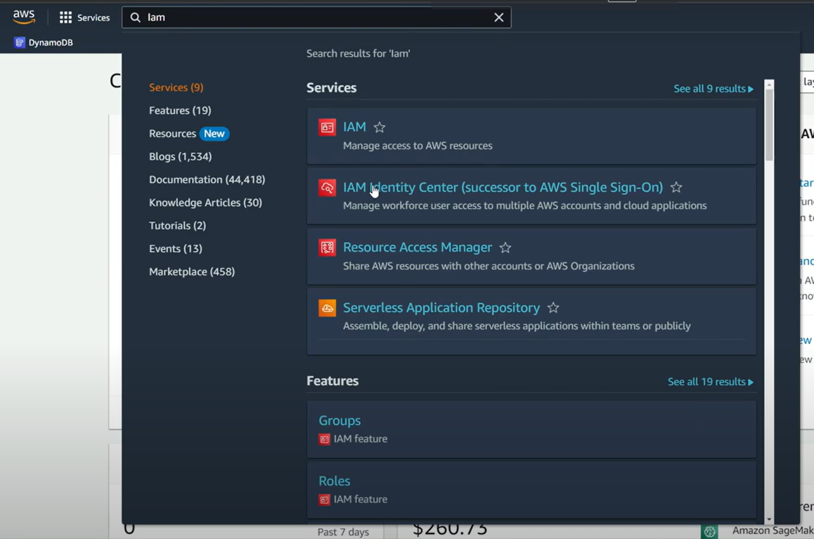

The IAM configuration enables:
- Access to the ECR (Elastic Container Registry).
- Launching and managing EC2 (Elastic Compute Cloud) instances.

### Framework Used
This project uses:
- **Elastic Beanstalk**: For simplifying deployment and scaling of applications. Elastic Beanstalk manages the deployment process, monitors application health, and handles scaling automatically.

### Alternative: Using SageMaker
**Amazon SageMaker** can be used as an alternative framework for deployment, particularly for machine learning workflows. SageMaker simplifies the process of training, deploying, and scaling ML models. To use SageMaker instead of Elastic Beanstalk, the following changes would be required:
- **Model Packaging**: Package the application as a SageMaker model by providing the necessary inference code and dependencies.
- **Endpoint Deployment**: Deploy the model to a SageMaker endpoint instead of EC2. This step involves creating an endpoint configuration and specifying the instance type.
- **Monitoring and Scaling**: Use SageMaker's built-in features for monitoring metrics and automatic scaling.

By switching to SageMaker, the deployment becomes more specialized for machine learning models, providing better support for tasks like distributed training, real-time inference, and batch predictions. They also provide seperate jupyter notebooks making the process streamlined.

